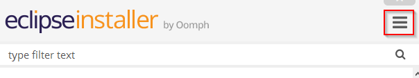

Configuración estándar para Eclipse
===================================

Este proyecto contiene una configuración estándar para Eclipse Neon a utilizar por todos los desarrolladores de Docout que empleen está herramienta.

Esta configuración, al ser utilizada por el instalador de Eclipse, asegura un entorno de trabajo  homogéneo para todo el equipo de desarrollo, utilizando las mismas configuraciones significativas y *plugins*. Adicionalmente, cualquier cambio realizado en la configuración es propagada automáticamente a todas las instalaciones de la misma que se hayan realizado.

Esta configuración es distribuida como un *setup model*, concretamente un *product model*. Estos *setup model* son utilizados (consumidos) por el instalador de Eclipse y contienen toda la información que este necesita para instalar y configurar Eclipse, sus distintos módulos, la colección común de plugins previamente aprobados y las distintas configuraciones.

Proceso de instalación
----------------------

El proceso de instalación es muy sencillo al estar prácticamente automatizado en su totalidad y consta de los siguientes pasos:

1. Descargar (e instalar si es necesario) el instalador correspondiente a nuestra plataforma desde la [página oficial](https://wiki.eclipse.org/Eclipse_Installer).
1. Ejecutar el instalador.
1. Para utilizar un *setup model* es necesario cambiar al modo avanzado del instalador. Para ello es necesario pulsar sobre el botón de menú presente en la esquina superior derecha:  
      
1. y seleccionar `Advanced Mode...`
1. El instalador muestra los catálogos conocidos junto con los productos de cada catálogo. Dado que nuestro producto no es oficial es necesario añadirlo como un producto de usuario. Para ello es necesario pulsar sobre el botón con un signo más verde presente debajo del logo de Oomph.
1. En la ventana que aparece hemos de introducir la URI del producto que deseamos instalar, en nuestro caso `https://raw.githubusercontent.com/DocoutSL/Eclipse.cfg/master/EclipseReingenieriaDocout.setup` y pulsar el botón `OK`.
1. Se añadirá y seleccionará el producto `Eclipse para el departamento de Reingenieria de Docout`. Pulsar sobre el botón `Next >`.
1. Pulsar nuevamente sobre el botón `Next >` sin seleccionar ningún proyecto.
1. En la siguiente pantalla, introducir la carpeta raíz de instalación y el nombre de carpeta en la que se va a instalar Eclipse y pulsar el botón `Next >`.
1. Finalmente, en la pantalla de confirmación, pulsar el botón `Finish` y, si es necesario, aceptar las licencias de software.
1. Después de unos minutos durante los cuales el instalador descargará e instalará los distintos paquetes necesarios, se iniciará por primera vez está instancia de Eclipse. Si lo deseamos podemos cerrar ya el instalador pulsando nuevamente sobre el botón `Finish`.
1. En cada inicio de Eclipse su configuración será sincronizada con la del repositorio, por lo que es conveniente reiniciarlo seleccionando la opción `Restart` del menú `File`.
1. Después de este reinicio Eclipse estará completamente instalado y configurado y listo para trabajar.

Cualquier incidencia, sugerencia o idea requerirá la apertura del [*issue*](/../../issues) correspondiente para posibilitar el seguimiento de las mismas.
